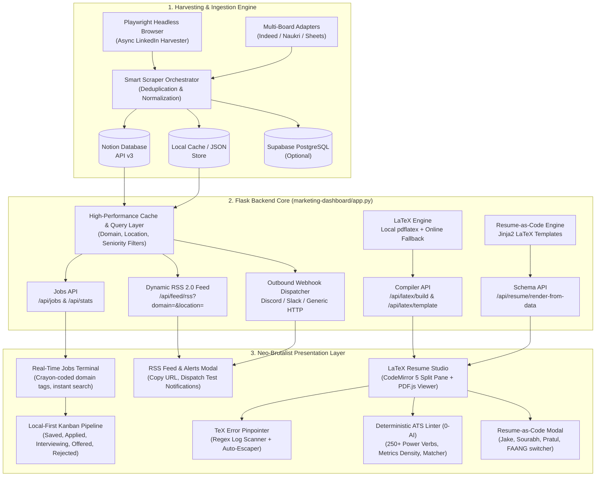

<div align="center">

# 🦆 RoleBoard — Job Discovery Terminal & LaTeX Resume Engine

**A high-performance real-time developer job discovery terminal, ATS resume auditor, and LaTeX engineering studio rendered in a neo-brutalist technical-playful design language on warm cream paper.**

[](https://python.org)
[](https://flask.palletsprojects.com/)
[](https://playwright.dev/)
[](https://www.latex-project.org/)
[](https://developers.notion.com/)
[](https://github.com/Dinesh-codeswell/Job-Dashboard)
[](https://github.com/Dinesh-codeswell/Job-Dashboard)
[](LICENSE)

[Live Dashboard](#-quick-start) • [Features](#-core-features) • [Architecture](#-architecture) • [LaTeX Studio](#-in-browser-latex-resume-studio) • [ATS Auditor](#-deterministic-ats-linter--action-verb-auditor-0-ai) • [Kanban Pipeline](#-local-first-application-pipeline) • [API Reference](#-api-reference)

</div>

---

## 📖 Table of Contents

- [Overview](#-overview)
- [System Architecture](#-system-architecture)
- [Design System & Aesthetics](#-design-system--aesthetics)
- [Core Features](#-core-features)
  - [1. Real-Time Opportunity Terminal](#1-real-time-opportunity-terminal)
  - [2. In-Browser LaTeX Resume Studio](#2-in-browser-latex-resume-studio)
  - [3. Smart TeX Error Pinpointer & Auto-Escaper](#3-smart-tex-error-pinpointer--latex-auto-escaper)
  - [4. Deterministic ATS Linter & Action Verb Auditor (0-AI)](#4-deterministic-ats-linter--action-verb-auditor-0-ai)
  - [5. Local-First Application Pipeline & Kanban Board](#5-local-first-application-pipeline--kanban-board)
  - [6. Resume-as-Code (JSON Schema & Multi-Template Switching)](#6-resume-as-code-json-schema--multi-template-switching)
  - [7. Dynamic Filtered RSS 2.0 Feeds & Outbound Webhook Alerts](#7-dynamic-filtered-rss-20-feeds--outbound-webhook-alerts)
  - [8. Scraping & Automation Core](#8-scraping--automation-core)
- [Repository Structure](#-repository-structure)
- [Quick Start](#-quick-start)
  - [Prerequisites](#prerequisites)
  - [Installation & Setup](#installation--setup)
  - [Running the Web Dashboard](#running-the-web-dashboard)
  - [Running Scrapers & Automations](#running-scrapers--automations)
- [Configuration & Environment Variables](#-configuration--environment-variables)
- [API Reference](#-api-reference)
- [Keyboard Shortcuts Reference](#-keyboard-shortcuts-reference)
- [Troubleshooting & FAQ](#-troubleshooting--faq)
- [Contributing & License](#-contributing--license)

---

## 💡 Overview

**RoleBoard** is an end-to-end recruitment engineering platform that bridges real-time job discovery, automated multi-destination harvesting, LaTeX resume composition, and deterministic application tracking.

Unlike generic job portals filled with bloated frameworks and black-box AI scrapers, RoleBoard operates on two strict technical principles:
1. **Zero-AI Deterministic Integrity**: Parsing, ATS grading, special-character escaping, keyword overlap matching, and error pinpointing rely strictly on formal grammar, regex tokens, set-intersection algorithms, and dictionary rules without external LLM dependencies, hallucinatory suggestions, or API subscription fees.
2. **MotherDuck Neo-Brutalism**: A warm cream paper canvas (`#f4efea`) hosting monospace-first terminal readouts (`JetBrains Mono`), flat offset drop shadows (`#383838 -4px 4px 0px 0px`), hard 2px corners, and crayon-coded chromatic button borders that cycle like colored pencils in a cup.

```
┌─────────────────────────────────────────────────────────────────────────────┐
│ 🦆 ROLEBOARD TERMINAL v2.4_live                           [ALERTS & RSS]    │
│ [// BROWSE ROLES]   [// APPLICATION PIPELINE (4)]         [BUILD RESUME ->] │
├─────────────────────────────────────────────────────────────────────────────┤
│ > [All Domains v]  [> search roles, companies...]  [Location v]  [Level v]  │
│ ✦ 3,420 ACTIVE ROLES ✦ 100% VERIFIED POSITIONS ✦ ZERO-AI ATS LINTER ✦       │
└─────────────────────────────────────────────────────────────────────────────┘
```

---

## 🏗 System Architecture



---

## 🎨 Design System & Aesthetics

RoleBoard is styled according to the **MotherDuck neo-brutalist technical-playful specification**:

| Token Name | Hex Value | CSS Variable | Semantic Usage |
|:---|:---|:---|:---|
| **Cream Paper** | `#f4efea` | `--color-cream-paper` | Base page canvas and section backgrounds (warm off-white notebook page) |
| **Frost White** | `#ffffff` | `--color-frost-white` | Card surfaces, top navigation bar, code editor panes, modal panels |
| **Chalk Gray** | `#f8f8f7` | `--color-chalk-gray` | Secondary column surfaces, kanban background, subtle inputs |
| **Charcoal Ink** | `#383838` | `--color-charcoal-ink` | Universal line color: primary text, all 2px borders, hard drop shadows |
| **Sky Crayon** | `#6fc2ff` | `--color-sky-crayon` | Primary action fills, active tabs, CTA buttons |
| **Canary Banner** | `#ffde00` | `--color-canary-banner` | Marquee strip, warning pills, highlight backgrounds |
| **Duck Bill Orange**| `#ff9538` | `--color-duck-bill-orange`| Decorative badges, secondary indicators |
| **Ice Wash** | `#ebf9ff` | `--color-ice-wash` | Soft button hover surfaces, tracking buttons, highlight washes |
| **Notebook Pale** | `#f9fbe7` | `--color-notebook-pale` | Tags, category pills, filter indicators |

### Geometric Rules
* **Borders**: Universal `2px solid #383838` on cards, inputs, tags, and navigation bars.
* **Border Radius**: Hard `2px` (`--radius-sm`, `--radius-buttons`).
* **Offset Drop Shadows**: Zero-blur hard drop shadows:
  - Standard buttons / small cards: `-3px 3px 0px 0px #383838`
  - Cards & panels: `-4px 4px 0px 0px #383838`
  - Floating modals: `-8px 8px 0px 0px #383838`
* **Typography**:
  - Primary / Universal: `JetBrains Mono` / `Aeonik Mono` (300, 400, 500, 600, 700) with `+0.02em` tracking.
  - Secondary / Text: `Inter` (300, 400, 500, 600) for reading-dense body copy.

---

## 🚀 Core Features

### 1. Real-Time Opportunity Terminal
* **Instant Filtering**: Multi-select domain filter dropdown (Software Engineering, Frontend, Backend, AI/ML, DevOps, Product, Marketing, Sales, Finance, Legal, etc.).
* **Experience & Location Matrix**: Filter positions by seniority (Entry Level, Mid Level, Senior Level) and major Indian tech hubs (Bengaluru, Hyderabad, Pune, Mumbai, Gurugram, Delhi/NCR, Remote).
* **High-Speed Debounced Search**: Monospace terminal query box with keyboard focus shortcut (`/`).
* **Non-Blocking Data Loading**: High-priority jobs fetch with background asynchronous resolution for stats, domains, and locations.

### 2. In-Browser LaTeX Resume Studio
* **Overleaf-Style Split Pane**: Real-time CodeMirror 5 LaTeX editor alongside an interactive PDF.js live preview pane with drag-to-resize split divider.
* **Dual Compilation Engine**: Automatically compiles locally using host `pdflatex` or seamlessly fails over to high-speed online cloud compilation (`latexonline.cc` / rtex).
* **4 Industry-Standard Templates**:
  1. **Jake** — The gold standard single-column software engineer resume (high information density).
  2. **Sourabh** — Minimalist modern developer layout with clean horizontal rules.
  3. **Pratul** — Executive technical layout with compact section headers.
  4. **FAANG** — Silicon Valley big-tech layout optimized for algorithmic hiring pipelines.
* **Productivity Toolkit**: Word wrap toggle, line numbers toggle, fullscreen mode (`F11`), LaTeX symbol picker, snippet inserter, and zoom controls (`50%` to `250%`).

### 3. Smart TeX Error Pinpointer & LaTeX Auto-Escaper
* **Log Error Regex Parsing**: Parses raw TeX engine compilation logs to extract the exact offending line (`l.<number>`) and culprit syntax token.
* **CodeMirror Line Pinpointing**: Automatically highlights the offending line with `.cm-error-line` and scrolls it into immediate view.
* **Interactive Jump Action**: Error modal displays an actionable `JUMP TO LINE X` button displaying the offending macro/token.
* **1-Click Auto-Escaper (`#autoEscapeBtn`)**: Scans your resume for unescaped characters that break LaTeX builds (`%`, `&`, `$`, `_`, `#`) and intelligently escapes them to `\%`, `\&`, `\$`, `\_`, `\#` while protecting full-line comments and tabular column delimiters.

### 4. Deterministic ATS Linter & Action Verb Auditor (0-AI)
* **100% Deterministic & Privacy-Safe**: Completely client-side execution in `static/js/ats-linter.js`. No resume data is ever sent to external LLMs or third-party AI services.
* **250+ Curated Power Verb Dictionary**: Checks bullet points for leadership and technical action verbs (*Spearheaded, Architected, Refactored, Accelerated, Engineered, Orchestrated*) versus passive or weak phrases (*Responsible for, Assisted with, Worked on, Helped*), providing instant replacement suggestions.
* **Quantifiable Metrics Density**: Detects measurable accomplishments including percentages (`+42%`), currency values (`$120K`), latency reductions (`250ms`), data scales (`10TB`), and team sizes.
* **Structural Health Checklist**: Audits contact details (email, phone, LinkedIn, GitHub) and verifies canonical resume sections (Education, Experience, Projects, Skills).
* **Target Job Description Keyword Matcher**: Paste any job description to compute a token overlap match score (`0–100%`) with color-coded chips for **Matched Keywords** vs **Missing Keywords**.
* **Toolbar Readiness Badge**: Displays real-time `ATS: XX/100` score badge directly in the editor toolbar.

### 5. Local-First Application Pipeline & Kanban Board
* **100% Private Browser Storage**: Pipeline records persist in `localStorage` under `roleboard_pipeline_v1`. Zero tracking, zero latency, offline-ready.
* **View Switcher**: Toggle seamlessly between `// BROWSE ROLES` and `// APPLICATION PIPELINE` with live application count badges.
* **1-Click Tracking**: Every card in the jobs feed features a `+ TRACK` button or quick status selector.
* **5-Stage Kanban Workflow**:
  - 📌 **Saved** — Discovered roles bookmarked for later review.
  - 📤 **Applied** — Submitted applications awaiting initial response.
  - 🎤 **Interviewing** — Active recruiter screens, technical rounds, and system design loops.
  - 🎉 **Offered** — Received formal job offers and compensation packages.
  - ⛔ **Rejected** — Closed applications archived for historical record.
* **Interactive Controls**: Move cards between stages via dropdown, append inline follow-up notes (e.g. *Recruiter call Friday 3 PM*), launch external job links, and export your entire pipeline to a clean **CSV** (`job_applications_pipeline_YYYY-MM-DD.csv`).

### 6. Resume-as-Code (JSON Schema & Multi-Template Switching)
* **Content Decoupled from Presentation**: Define career data in a structured schema (`resume_schemas.py`) inspired by *RenderCV*.
* **Jinja2 LaTeX Rendering**: Clean template files populate LaTeX syntax dynamically using custom TeX-escaping filters.
* **Seamless Template Switching**: Switch between Jake, Sourabh, Pratul, and FAANG layouts without retyping or losing a single bullet point.
* **JSON Schema Modal**: View, edit, copy, and download `resume_data.json` directly from the editor toolbar.

### 7. Dynamic Filtered RSS 2.0 Feeds & Outbound Webhook Alerts
* **Dynamic RSS 2.0 Feed (`GET /api/feed/rss`)**: Generates real-time RSS feeds reflecting current UI filter parameters:
  ```
  http://localhost:5001/api/feed/rss?domain=Engineering&location=Bengaluru&level=Senior+Level
  ```
  Compatible with any RSS reader (Feedly, NetNewsWire, Miniflux, Apple News) or Slack RSS integrations (`/feed subscribe <URL>`).
* **Outbound Webhook Dispatcher (`POST /api/webhook/test`)**: Send real-time notification alerts directly to:
  - **Discord**: Formatted rich embeds with colored sidebars, company details, location, and apply buttons.
  - **Slack**: Block Kit messages with structured fields and action buttons.
  - **Generic Webhook**: Clean JSON payload dispatched via HTTP POST to Zapier, Make, n8n, or custom microservices.

### 8. Scraping & Automation Core
* **Async Playwright Automation**: Headless browser scraping with stealth evasions, randomized user-agents, mouse jitter, and session persistence.
* **Multi-Destination Sync Engine**:
  - Notion Database API (v3+ block queries, multi-select properties, date sorting)
  - Google Sheets API (v4 batch update and automated appending)
  - Supabase PostgreSQL (direct relational persistence)
* **CLI Automation Suite**: Windows PowerShell commands and batch scripts (`scraper-status`, `scraper-start`, `scraper-run`, `scraper-logs`).
* **WhatsApp Notification Dispatcher**: Twilio API and WhatsApp Web automation for instant job alerts to your phone.

---

## 📁 Repository Structure

```
Job-Dashboard/
├── marketing-dashboard/              # Primary Neo-Brutalist Flask Web Application
│   ├── app.py                       # Main Flask server, API routes, caching, LaTeX compiler
│   ├── resume_schemas.py            # Resume-as-Code Jinja2 templates (Jake, Sourabh, Pratul, FAANG)
│   ├── config.py                    # Environment configuration & defaults
│   ├── requirements.txt             # Web dashboard Python dependencies
│   ├── templates/
│   │   ├── index.html               # Jobs terminal, Kanban pipeline, RSS/Webhook modal
│   │   └── resume.html              # LaTeX editor, ATS drawer, JSON modal, preview pane
│   └── static/
│       ├── css/
│       │   └── style.css            # Complete MotherDuck neo-brutalist design system
│       └── js/
│           ├── api.js               # Client API wrapper & in-memory cache
│           ├── ats-linter.js        # Deterministic 0-AI ATS scoring & verb engine
│           ├── main.js              # Terminal, Kanban pipeline, alerts modal logic
│           ├── resume.js            # LaTeX editor, compiler, PDF.js, error pinpointer
│           ├── sparkles.js          # Subtle crayon dust background animation
│           └── utils.js             # Formatting, sanitization, debounce utilities
├── linkedin_scraper/                # Async Playwright scraping library
│   ├── core/                        # Browser lifecycle, stealth, proxy drivers
│   ├── scrapers/                    # Specialized LinkedIn job & post parsers
│   └── integrations/                # Notion, Sheets, Supabase adapters
├── dashboard/                       # Legacy / Alternative Next.js Dashboard
├── scrape_india_jobs_notion_optimized.py # High-throughput Notion job harvester
├── scrape_non_tech_roles_notion.py  # Non-tech roles scraper (Product, HR, Marketing)
├── process_manual_posts.py          # Google Sheets manual URL ingestion pipeline
├── whatsapp_notifier.py             # Twilio & Cloud API WhatsApp dispatcher
├── whatsapp_web_notifier.py         # Playwright-driven WhatsApp Web notifier
├── automation_tools.ps1             # PowerShell management commands (scraper-*)
├── automation_manager.bat           # Interactive Windows automation control menu
└── README.md                        # Project documentation (this file)
```

---

## 🛠 Quick Start

### Prerequisites
* **Python**: `3.10` or higher (`python --version`)
* **Node.js**: `18.0` or higher (required for Playwright browser dependencies)
* **Git**: Installed and configured
* *(Optional)* **LaTeX Engine**: `pdflatex` (TeX Live or MiKTeX) for offline compilation. If omitted, RoleBoard automatically compiles via high-speed online cloud failover.

### Installation & Setup

1. **Clone the repository**:
   ```bash
   git clone https://github.com/Dinesh-codeswell/Job-Dashboard.git
   cd Job-Dashboard
   ```

2. **Create and activate a virtual environment**:
   ```bash
   # Windows (PowerShell)
   python -m venv venv
   .\venv\Scripts\Activate.ps1

   # Linux / macOS
   python3 -m venv venv
   source venv/bin/activate
   ```

3. **Install Dashboard Dependencies**:
   ```bash
   cd marketing-dashboard
   pip install -r requirements.txt
   ```

4. **Install Scraper Dependencies & Playwright Browsers** *(if running scrapers)*:
   ```bash
   pip install playwright notion-client google-api-python-client twilio
   playwright install chromium
   ```

### Running the Web Dashboard

1. **Configure Environment**:
   ```bash
   # Inside marketing-dashboard/
   cp .env.example .env
   # Edit .env with your Notion credentials (or leave empty to run offline cache)
   ```

2. **Launch the Flask Application**:
   ```bash
   python app.py
   ```
   *The server starts at **`http://localhost:5001`**.*

3. **Access Key Interfaces**:
   - **Jobs Terminal & Application Pipeline**: `http://localhost:5001/`
   - **LaTeX Resume Studio & ATS Linter**: `http://localhost:5001/resume`
   - **Filtered RSS Feed**: `http://localhost:5001/api/feed/rss`

---

## ⚙️ Running Scrapers & Automations

### Interactive Automation Menu (Windows)
Double-click `automation_manager.bat` or run:
```powershell
.\automation_manager.bat
```

### PowerShell Automation Tools
Load the automation helper functions into your current terminal session:
```powershell
. .\automation_tools.ps1
```
Available CLI commands:
* `scraper` — Launch interactive control menu.
* `scraper-status` — Check running automation tasks and process health.
* `scraper-start` — Start recurring scheduled scraper in the background.
* `scraper-stop` — Terminate all active scraper tasks.
* `scraper-run` — Trigger an immediate one-shot scrape.
* `scraper-logs` — Tail recent execution logs.

### Running Scrapers Manually
```bash
# Scrape Indian Tech Roles directly to Notion
python scrape_india_jobs_notion_optimized.py

# Scrape Non-Tech Roles (Product, Marketing, Finance)
python scrape_non_tech_roles_notion.py

# Process manual LinkedIn URLs from Google Sheets
python process_manual_posts.py
```

---

## 🔐 Configuration & Environment Variables

Copy `.env.example` in both the root directory and `marketing-dashboard/` to `.env`.

### `marketing-dashboard/.env`
| Variable | Required | Default | Description |
|:---|:---:|:---|:---|
| `PORT` | No | `5001` | Local development port |
| `HOST` | No | `0.0.0.0` | Bind host address |
| `SECRET_KEY` | Yes | `your-secret-key` | Session and CSRF encryption key |
| `NOTION_API_KEY` | Optional | `secret_...` | Notion Internal Integration token |
| `NOTION_DATABASE_ID` | Optional | `UUID` | Target Notion Database UUID for live jobs |
| `JOBS_PER_PAGE` | No | `30` | Number of roles per pagination batch |
| `AUTO_REFRESH_INTERVAL`| No | `60` | Background cache refresh timer (seconds) |

### Root `.env` (Scraper & Notifications)
| Variable | Required | Default | Description |
|:---|:---:|:---|:---|
| `LINKEDIN_EMAIL` | Optional | `—` | LinkedIn account email (for authenticated sessions) |
| `LINKEDIN_PASSWORD` | Optional | `—` | LinkedIn account password |
| `GOOGLE_SHEET_ID` | Optional | `—` | Target Google Sheet ID for manual URLs |
| `GOOGLE_CREDENTIALS_FILE` | Optional | `credentials.json` | Google Service Account key file path |
| `TWILIO_ACCOUNT_SID` | Optional | `—` | Twilio Account SID for WhatsApp alerts |
| `TWILIO_AUTH_TOKEN` | Optional | `—` | Twilio Auth Token |
| `TWILIO_WHATSAPP_FROM`| Optional | `whatsapp:+14155238886` | Twilio WhatsApp sender phone number |
| `WHATSAPP_TO` | Optional | `whatsapp:+91...` | Target phone number for job alert dispatch |

---

## 📡 API Reference

### Jobs & Discovery Endpoints

| Method | Endpoint | Description |
|:---|:---|:---|
| `GET` | `/api/jobs` | Paginated list of jobs. Supports `page`, `limit`, `domains`, `search`, `location`, `level`. |
| `GET` | `/api/stats` | Aggregated metrics (total active roles, companies count, category distribution). |
| `GET` | `/api/domains` | List of all available domain categories. |
| `GET` | `/api/locations`| Unique locations extracted from the database. |
| `POST` | `/api/refresh` | Clears server cache and triggers a fresh Notion query. |

### LaTeX & Resume Endpoints

| Method | Endpoint | Description |
|:---|:---|:---|
| `POST` | `/api/latex/build` | Compiles LaTeX code. Returns binary PDF or JSON error `{ success: false, error, line, culprit }`. |
| `GET` | `/api/latex/template` | Returns raw LaTeX for a template (`?template=jake\|sourabh\|pratul\|faang`). |
| `GET` | `/api/resume/schema-default`| Returns default structured JSON resume data schema. |
| `POST` | `/api/resume/render-from-data`| Renders clean LaTeX from `{ template, data }` JSON payload. |

### Feeds & Webhooks Endpoints

| Method | Endpoint | Description |
|:---|:---|:---|
| `GET` | `/api/feed/rss` | Generates a valid RSS 2.0 XML feed reflecting current active filters (`?domain=&location=&level=`). |
| `POST` | `/api/webhook/test` | Dispatches a test alert card to `{ webhook_url, platform: 'discord'\|'slack'\|'generic', job }`. |

---

## ⌨️ Keyboard Shortcuts Reference

### Terminal & Discovery View
| Shortcut | Action |
|:---|:---|
| <kbd>/</kbd> | Focus search query box |
| <kbd>r</kbd> | Trigger instant job feed refresh |
| <kbd>→</kbd> | Next pagination page |
| <kbd>←</kbd> | Previous pagination page |
| <kbd>Escape</kbd> | Close active dropdown or modal |

### LaTeX Resume Studio
| Shortcut | Action |
|:---|:---|
| <kbd>Ctrl</kbd> + <kbd>Enter</kbd> / <kbd>Cmd</kbd> + <kbd>Enter</kbd> | Compile resume to PDF |
| <kbd>Ctrl</kbd> + <kbd>S</kbd> / <kbd>Cmd</kbd> + <kbd>S</kbd> | Save & compile |
| <kbd>Ctrl</kbd> + <kbd>H</kbd> / <kbd>Cmd</kbd> + <kbd>H</kbd> | Open Search & Replace modal |
| <kbd>Ctrl</kbd> + <kbd>=</kbd> / <kbd>Cmd</kbd> + <kbd>=</kbd> | Zoom in PDF preview |
| <kbd>Ctrl</kbd> + <kbd>-</kbd> / <kbd>Cmd</kbd> + <kbd>-</kbd> | Zoom out PDF preview |
| <kbd>Ctrl</kbd> + <kbd>/</kbd> | Toggle line comment (`%`) |
| <kbd>Ctrl</kbd> + <kbd>Shift</kbd> + <kbd>L</kbd> | Toggle line numbers |
| <kbd>F11</kbd> | Toggle distraction-free full-screen editor |

---

## ❓ Troubleshooting & FAQ

<details>
<summary><strong>1. Why is compilation failing with "Local pdflatex error" or missing packages?</strong></summary>

RoleBoard automatically handles this. If local `pdflatex` is not installed or lacks specific LaTeX packages (`titlesec`, `marvosym`, etc.), the server automatically falls back to an online compilation cluster (`latexonline.cc` / rtex). Ensure your machine has internet access.
</details>

<details>
<summary><strong>2. Why did my LaTeX compile fail with an unescaped character?</strong></summary>

LaTeX reserves characters like `%`, `&`, `$`, `_`, and `#`. If you paste bullet points with *"$100k revenue"* or *"increased by 25%"*, click the **Auto-Escape** button (`#autoEscapeBtn` / spellcheck icon) in the editor toolbar. It will automatically escape these characters and recompile.
</details>

<details>
<summary><strong>3. Are my application pipeline records safe if I clear my cookies?</strong></summary>

Application Pipeline records are stored in browser `localStorage`. Clearing site cookies will not delete them, but clearing "Local Storage / Site Data" will. Always click **EXPORT CSV** in the Pipeline view periodically to keep an offline backup of your active job search.
</details>

<details>
<summary><strong>4. Does the ATS Linter use an LLM or send my resume to OpenAI?</strong></summary>

**No.** The ATS Linter is 100% deterministic, zero-AI, and executes entirely in your browser using regex tokenizers and curated action verb dictionaries. Your resume text never leaves your computer for ATS evaluation.
</details>

---

## 🤝 Contributing

Contributions are welcome! Please follow these steps:
1. Fork the repository.
2. Create a feature branch: `git checkout -b feature/amazing-feature`.
3. Commit your changes: `git commit -m "Add amazing feature"`.
4. Push to the branch: `git push origin feature/amazing-feature`.
5. Open a Pull Request.

Please ensure all frontend changes adhere to the **MotherDuck neo-brutalist design guidelines** (2px borders, `#383838` line styling, `-4px 4px 0px 0px` hard drop shadows, and `JetBrains Mono` typography).

---

## 📄 License

This project is licensed under the terms of the [MIT License](LICENSE).

<div align="center">

**Built with 🦆 on cream paper.**

</div>
